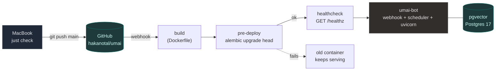

# Railway: deploy, and reading the logs

*How Umai reaches production, and how to look at it once it is there. Written for whoever —
person or agent — arrives at this repository needing to answer "what is running, and why is it
doing that". The design rationale lives in `docs/technical-implementation.md` §11; this page is
the operational surface.*

## 1. The coordinates

Everything below needs these. They do not change.

| | Value |
|---|---|
| Project | `UMAI` — `8a70bbe0-e3fc-49b9-8d48-3cbedcae224a` |
| Environment | `production` — `820cc4a0-25dc-4a94-a348-463161860ac7` |
| App service | `umai-bot` — `fd883bd1-b0f2-4d99-a11e-bc70391c31b6` |
| Database service | `pgvector` — `574213c7-6f5b-41f9-97ca-1e3c82fb4657` |
| Public domain | `https://umai-bot-production.up.railway.app` |
| Repo | `hakanotal/umai`, branch `main` |

**The service is called `umai-bot`, not `umai`, and the database is called `pgvector`, not
`Postgres`.** Both wrong names appeared in `justfile` deploy recipes for a while and the CLI's
answer is a flat `Service 'umai' not found`, which reads like an auth problem rather than a typo.
If a Railway command fails with "not found", check the name against this table before checking
anything else.

## 2. How a deploy happens

The ordinary deploy is `git push origin main`. Nothing else. The `umai-bot` service is connected
to the GitHub repository, so the push fires a webhook, Railway builds the `Dockerfile` named in
`railway.json`, runs `alembic upgrade head` as a **pre-deploy command**, and only replaces the
running container if the migration succeeded.



Pre-deploy is the right hook for migrations because it runs once and gates the release. Putting
them in the container's start command turns a crash loop into a migration loop against real data,
which is why `CMD` in the `Dockerfile` is `python -m umai` and nothing else.

`railway.json` also sets `healthcheckPath: /healthz` — which checks the database, not just
liveness (`src/umai/web/api.py:37`) — a 300s healthcheck timeout, `restartPolicyType: ON_FAILURE`
with ten retries, and `numReplicas: 1`.

**One replica, and this is not a cost decision.** The single process holds the aiogram bot, an
in-process APScheduler and uvicorn on one event loop, and Telegram permits exactly one webhook
consumer per token. A second replica is a second bot answering the same user. The photo volume
mounted at `/app/data/media` pins it to one host anyway.

Before pushing anything that touches the image, run it locally: `just docker-app` builds the same
`Dockerfile` against the dev database, where the logs are in a terminal rather than in a build log.

### Bypassing the push

`railway up --service umai-bot` builds and deploys the working tree, uncommitted changes included.
This is for a hotfix you have not pushed. It leaves prod ahead of `main`, so follow it with a real
push, and `list_deployments` will show a deployment with no commit hash — that is the tell.

## 3. Reading the service logs

Two routes, and they suit different callers.

**The MCP tools** (`mcp__railway__*`) are the better choice for an agent: they take explicit ids,
they never stream, and they return a bounded block of text. `get_logs` needs `project_id`,
`environment_id` and `service_id` together — omitting `environment_id` fails with a listing of
the available environments rather than defaulting, because nothing is linked in a fresh shell.

```
mcp__railway__get_logs(
    project_id="8a70bbe0-e3fc-49b9-8d48-3cbedcae224a",
    environment_id="820cc4a0-25dc-4a94-a348-463161860ac7",
    service_id="fd883bd1-b0f2-4d99-a11e-bc70391c31b6",
    log_type="deploy",     # or "build", or "http"
    lines=100,
    level="error",         # optional, build/deploy only
    search="enrichment",   # optional, build/deploy only
    since="2h",            # relative, or ISO 8601
)
```

`log_type` picks the stream, and picking the wrong one is the usual reason logs look empty:
`deploy` is the running container's stdout, `build` is the image build (the place a failed deploy
explains itself), and `http` is the edge request log, filterable by `status`, `method`, `path` and
`request_id` — `status=">=400"` on `/ingest/health` is how you tell a phone that stopped syncing
from a phone with a stale token.

**The CLI** is fine interactively, with one trap:

```bash
railway logs --service umai-bot -n 100      # historical, returns
railway logs --service umai-bot             # STREAMS — never returns
railway logs --service umai-bot -b -n 200   # build logs
railway logs --service umai-bot --http -n 50
```

**Bare `railway logs` streams and does not exit.** An agent that calls it without `-n`, `--since`
or `--until` hangs until the tool times out. Always pass one of the three. The `just` recipes
encode that, and are the shortest safe path from a terminal:

| Recipe | Gives you |
|---|---|
| `just logs` | last 200 deploy lines, and returns |
| `just logs-follow` | the streaming one, when you actually want it |
| `just logs-build` | last 200 build lines |
| `just logs-http` / `just logs-http '>=400'` | edge requests, optionally only failures |
| `just status` | what is deployed, plus variable *names* |

### What normal looks like

Logging is `logging.basicConfig(level=INFO, format="%(levelname)s %(name)s %(message)s")`
(`src/umai/__main__.py:168`), so every line is level, logger name, message. The logger name is the
fastest filter you have:

| Logger | What it tells you |
|---|---|
| `aiogram.event` | `Update id=… is handled. Duration 397 ms` — the round trip a user felt. A photo legitimately takes 17–90s. |
| `umai.core.enrichment` | `'cacık' -> cacik (59 kcal/100g), 3 items backfilled` — the food table filling itself. |
| `umai.telegram.handlers.common` | the post-photo enrichment nudge, with the researched/added/backfilled/rejected tally |
| `apscheduler.executors.default` | `Running job "user_tick (trigger: interval[0:05:00]…)"` — the five-minute per-user tick. Its silence is the symptom of a wedged event loop. |
| `httpx2` | every OpenRouter call. Volume here is model spend. |
| `umai.web.api` | `healthz: database unreachable` is the one to grep for |

`aiogram.exceptions.TelegramNetworkError: Request timeout error` appears from time to time and is
Telegram's API being slow, not a bug; aiogram retries. It is only interesting if it is continuous.

**`499` on `POST /webhook/telegram`** is the client (Telegram) hanging up —
transient, and only interesting if continuous. The webhook acknowledges before
it runs the handler, and a `SeenUpdates` registry drops an `update_id` it has
already accepted, so a redelivered update is not re-processed. A meal counted
more than once is therefore a new bug, most likely a handler blocking the event
loop. The query that finds duplicate-counted meals, should one appear:

```sql
select e.id, e.logged_at, e.source, sum(fi.kcal)
from log_entries e join food_items fi on fi.entry_id = e.id
where e.superseded_by is null and e.source = 'photo'
group by 1,2,3 order by 2;
```

Adjacent `photo` entries seconds apart, sharing a media row, are the shape to
chase — not a fast eater.

Deployment history, which is what you actually want after a failed push:

```
mcp__railway__list_deployments(project_id=…, environment_id=…, service_id=…, limit=5)
→ d932448c… | SUCCESS | 2026-08-25 02:06:57 UTC | 39f6939…
```

A `FAILED` row with **no commit hash** was a `railway up` from a working tree. A `FAILED` row
whose build log contains nothing but two `scheduling build` lines is not a broken builder — it is
a `Dockerfile` flag Railway's builder rejected before the build began, which historically meant
`RUN --mount=type=cache`. Read `log_type="build"` on that specific `deployment_id` before
concluding anything about the platform.

## 4. Reading the production database

The dev conveniences — `just q`, `just pgadmin` — talk to the Docker container on port 5433 and
have no production equivalent. In prod the path is the `pgvector` service's `DATABASE_PUBLIC_URL`,
which exists because that service has a TCP proxy, and `railway run` injects it without ever
printing it:

```bash
# one query
railway run --service pgvector -- \
    sh -c 'psql "$DATABASE_PUBLIC_URL" -tAc "select count(*) from log_entries"'

# any of the ready-made queries in sql/ against prod
railway run --service pgvector -- \
    sh -c 'psql "$DATABASE_PUBLIC_URL" -f -' < sql/today.sql

# an interactive shell
railway connect pgvector
```

`just q-prod sql/row-counts.sql` is the same thing wrapped, and is the production counterpart of
`just q`.

`sql/README.md` indexes the twelve ready-made queries and explains the one rule for writing your
own. `row-counts.sql` is the "is anything in here at all" query and the right first move on a
quiet bot; `unmatched.sql` and `enrichment.sql` are the pair that explain a meal reporting
implausible calories; `spend.sql` is model cost by day, task and model.

**Every one of them is safe to run against prod and none of them writes.** Keep it that way — a
`psql` session opened this way is the production database with no seatbelt, and the schema's
immutability guarantees (`superseded_by` chains, the `corrections` table) exist in application
code, not in triggers. Fixing data by hand here bypasses them silently.

Take a copy you hold yourself before you need one:

```bash
just backup      # → backups/umai-YYYYMMDD.sql.gz
```

Railway snapshots the volumes on a schedule, but a backup you cannot restore without the provider
is not the whole story.

## 5. Variables

They live on the service and nowhere else; `.env.example` is the local-development template only.
List the names without exposing the values:

```bash
railway variables --service umai-bot --kv | cut -d= -f1
```

`umai-bot` carries `DATABASE_URL` (a reference to the `pgvector` service), `OPENROUTER_API_KEY`,
`TELEGRAM_BOT_TOKEN`, `TELEGRAM_WEBHOOK_URL`, `TELEGRAM_WEBHOOK_SECRET`, `UMAI_ENV=prod`,
`UMAI_INVITE_CODE`, `UMAI_BOOTSTRAP_ADMIN_TELEGRAM_ID`, `UMAI_HTTP_HOST`, `UMAI_HTTP_PORT`,
`UMAI_WATER_TARGET_ML`, `MEDIA_DIR` and `TZ`, alongside Railway's own `RAILWAY_*` and `PORT`.
Never echo the values into a transcript.

Three of these are platform accommodations rather than configuration, all handled in
`config/settings.py`: Railway publishes a libpq-style `postgresql://` DSN that
`normalise_async_dsn` rewrites for asyncpg (which rejects `sslmode` rather than ignoring it);
Railway assigns the port it health-checks, so `PORT` is an accepted fallback for `UMAI_HTTP_PORT`
and must win unless `UMAI_HTTP_PORT` deliberately matches it; and `UMAI_HTTP_HOST=0.0.0.0` is set
in prod while the code's default stays loopback, so the Mac never quietly widens.

## 6. A triage order that works

| Symptom | First thing to look at |
|---|---|
| Bot silent | `get_logs(log_type="deploy")` — is `apscheduler` still ticking? A wedged loop stops that first. |
| Bot silent, no logs at all | `list_deployments` — did the last push fail and leave an old container up? |
| Deploy failed, empty build log | `get_logs(log_type="build", deployment_id=…)`. Suspect a `Dockerfile` flag, not the builder. |
| Deploy failed after building | The pre-deploy migration. `search="alembic"` on the deploy log. |
| A meal logged as absurd calories | `sql/unmatched.sql`, then `sql/enrichment.sql` |
| Steps missing for a day | `get_logs(log_type="http", path="/ingest/health")`, then `sql/steps.sql` — a **zero** is a different answer from a **missing** day |
| Cost spike | `sql/spend.sql`, and count `httpx2` lines in the deploy log — check for 499-driven duplicate handling first |
| A meal counted two or three times | `get_logs(log_type="http", status="499", path="/webhook/telegram")` — a fresh one is a new bug; see §3 |
| `/healthz` failing | The `pgvector` service, not the bot |

## 7. Known drift

`railway.json` is Config-as-Code, which Railway has deprecated in favour of
`.railway/railway.ts`; every CLI invocation prints a warning saying so, and existing files keep
working **until 2026-12-01**. Migrating (`railway config migrate`) is a real task with a deadline,
not a warning to ignore. Until it is done, expect that warning on stderr in every recipe's output
and do not mistake it for the failure you are debugging.
