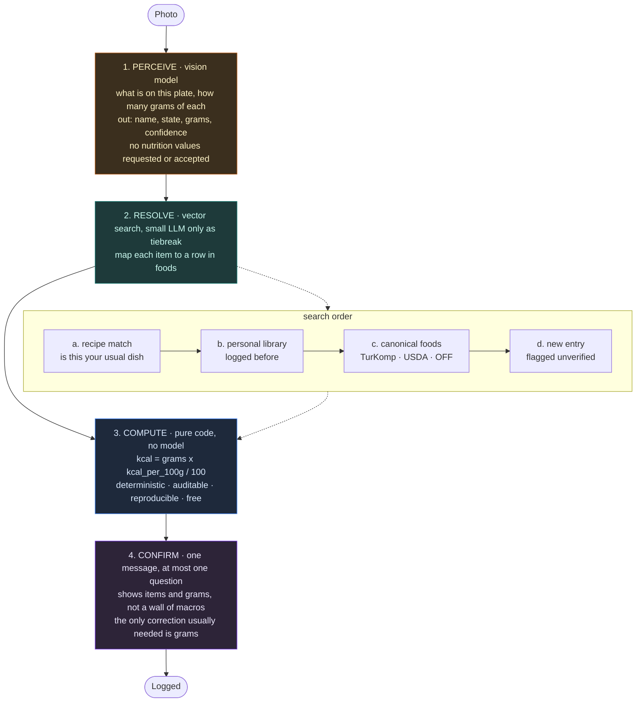
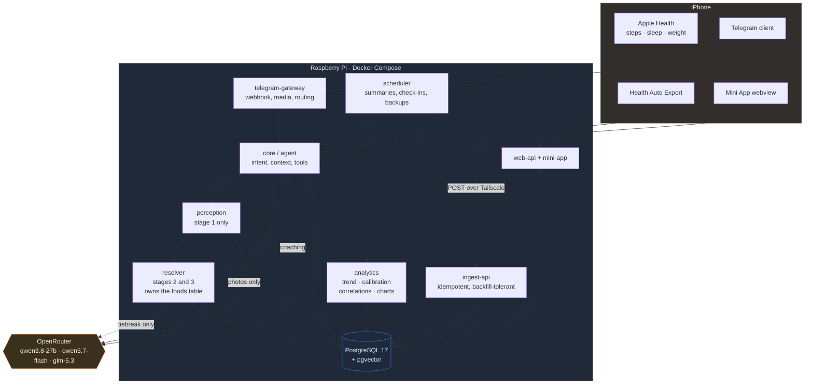

# Umai: Project Plan

*A self-hosted personal nutrition and health coach. Photo-first logging, calibrated estimates, proactive coaching. Runs on a Raspberry Pi, lives inside Telegram.*

**Version:** 1.1
**Date:** 22 August 2026
**Status:** Planning, pre-build

**Scope decisions taken:**

| Question | Answer | Consequence |
|---|---|---|
| Who is it for | You first, others later | Single-user build, multi-user-capable schema. No auth complexity now. |
| Cuisine | Turkish and Western, home cooking and eating out | Layered food data: TurKomp for Turkish, USDA for generics, Open Food Facts for packaged. |
| Language | English throughout | Canonical English food names with a Turkish alias array. Sources join cleanly. |
| Eating pattern | Roughly half home-cooked, half out | Recipe engine moves into Phase 2, not Phase 3. Restaurant pre-commitment matters. |
| Model API | OpenRouter, cheapest workable | `qwen/qwen3.8-27b` perception, `qwen/qwen3.7-flash` utility, `z-ai/glm-5.3` coach. About $1.36 a month. |

**Companion documents:** `model-selection.md` (model tiers, pricing, `config/models.py`),
`technical-implementation.md` (local development on the Mac, stack, testing, deploy to the Pi),
`eval/` (the twenty-photo baseline harness).

---

## 0. What changed from the draft

The draft described a good system. This plan keeps the concept and changes five things that materially affect whether it works.

**1. Estimation is split into perception, resolution and arithmetic.**
One model asked for calories is the design every photo-calorie app uses and it is the reason none of them improve with use. Umai asks the vision model only what it is good at (what is on the plate, roughly how many grams, in what state), resolves each item against a food composition table, and computes the macros in code. Section 4 covers this in full. It makes estimates deterministic, auditable, correctable, and cheap.

**2. Photo calorie estimates are not accurate, and the plan is now built around that fact.**
Peer-reviewed evaluation of frontier vision models on food photographs found a mean absolute percentage error around 36% for both weight and energy estimation, with systematic underestimation that grows with portion size. Displaying "1,847 kcal" from a photo is precision theater. Umai instead treats every photo estimate as a noisy sensor reading and continuously calibrates it against ground truth (your weight trend). This calibration engine is the centerpiece of the system and the single largest differentiator versus the commercial photo-calorie apps.

**3. Wearable hardware is deferred. Start with the iPhone you already own.**
The iPhone's built-in pedometer already writes steps, walking distance and flights climbed to Apple Health with no purchase and no charging routine. Sleep and heart rate are pleasant additions but they do not feed the calorie math, they feed the correlation engine, which needs months of data before it says anything trustworthy anyway. Buy a band in Phase 3 if the correlations look interesting, not before.

**4. Grafana is demoted to optional. A Telegram Mini App replaces it.**
Grafana is an infrastructure monitoring tool. It reads, it does not write. The thing you will actually want at 9pm is to fix the lunch entry the model got wrong, and Grafana cannot do that. A Mini App served from the same process, authenticated by Telegram's own signed payload, opens inside the chat, renders the charts, and lets you edit.

**5. Statistics are computed in code. The language model only narrates.**
The fastest way to destroy trust in a health assistant is one confidently invented correlation. Every number Umai says out loud comes from a tool call against the database, never from the model's own arithmetic or pattern matching.

---

## 1. Vision

Most people who try to lose weight fail at one of two points: they stop logging within three weeks, or they log faithfully and the numbers lie to them.

Umai attacks both. Logging is reduced to a photo, a sentence, or a single tap, and it never blocks on completeness. The numbers are treated as estimates with known error, and the system corrects its own bias against the only ground truth that matters, which is what your body actually does over time.

The product is not the log. The log is the tax you pay. The product is a system that notices things about you that you would not notice yourself, tells you at the moment the information is actionable, and does it without moralising.

### Design principles

**Frictionless or it does not exist.** Any interaction that takes more than a few seconds will be abandoned within a month. Every feature is judged against this first.

**Never block on completeness.** A partially logged day is infinitely more valuable than an abandoned one. Umai accepts vague input, records the uncertainty, and refines later if it can.

**Honest about uncertainty.** Ranges, not false decimals. When the system does not know, it says so.

**Trends, never single points.** Daily weight swings one to two kilograms on water and glycogen alone. Umai never reacts to a single reading, and coaches in trend language.

**Never shame.** The most important moment in a weight loss attempt is the morning after a bad day. Most apps say nothing or quietly guilt you. Umai handles this explicitly: acknowledge, contextualise, reset, move on.

**Offer options, do not prescribe.** "You are 40g short on protein. Yoghurt gets you 17g, two eggs 12g, or you can carry it into tomorrow" beats "eat more protein."

**Your data stays yours.** Self-hosted, local database, one command exports everything, no lock-in.

### Non-goals

Not a medical device and not a substitute for clinical care. Not a social or gamified fitness app. Not a precision tool for competitive athletes or clinical nutrition, where the error rates involved are disqualifying. Not a general chatbot.

---

## 2. Design decisions and alternatives considered

This section is the answer to "find the best solution for everything." Each row is a decision, the alternatives, and the reason.

### 2.1 Activity and sleep capture

| Option | What you get | Cost | Verdict |
|---|---|---|---|
| **iPhone alone (recommended for Phase 0 to 2)** | Steps, distance, flights, workouts logged manually. Written to Apple Health automatically by the motion coprocessor. | 0 | **Start here.** Accurate to roughly 5 to 10% for walking when the phone is carried. Its weakness is that it undercounts when the phone is on a desk, which is a consistent bias the calibration engine absorbs. |
| Budget band (Amazfit Band 7, Xiaomi Smart Band 9/10) | Adds sleep stages, heart rate, resting HR, continuous wear. Syncs to Apple Health via Zepp or Mi Fitness. | 30 to 50 USD | **Phase 3, optional.** Adds nothing to the calorie math. Adds real value to the correlation engine, but only after several months of baseline data exist. Requires a nightly charging habit that many people abandon. |
| Smart ring (Oura, RingConn, Ultrahuman) | Best consumer sleep and recovery data, no wrist bulk. | 200 to 350 USD, some with subscriptions | Defer. Good hardware, poor cost fit for a project whose entire hardware budget is a Pi you already own. |
| Apple Watch | Best-in-class integration, heart rate, workouts, sleep, and it writes activity energy directly to Apple Health. | 250+ USD | Only if you already own one or want one anyway. Do not buy for this project. |
| Under-mattress sensor (Withings Sleep, Eight Sleep) | Passive sleep tracking with zero wear burden. | 100 to 500 USD | Interesting alternative to a band if sleep specifically is what you care about, because there is nothing to charge or wear. Phase 3 at earliest. |

**Decision: iPhone only until Phase 3.** The build is not blocked on any purchase.

**Critical design rule regardless of device: do not add exercise calories back into the daily budget.** Consumer wearables and phone estimates overstate energy expenditure, often substantially. Feeding that number back as "you earned 400 more calories" is the single most reliable way to erase a deficit. Activity data enters Umai in exactly two places: as an input to the adaptive expenditure model (where it is weighted, not trusted), and as context for insight ("your step count dropped 30% this week").

### 2.2 Body weight capture

| Option | Verdict |
|---|---|
| Manual entry via Telegram, one tap in the morning | Works, but adherence decays, and the calibration engine depends on this signal more than any other. |
| **Smart scale writing to Apple Health (recommended)** | A Wi-Fi or Bluetooth scale (Withings, Xiaomi, Renpho, roughly 30 to 100 USD) makes weight fully passive: you stand on it, it appears in the database. Because the calibration engine is only as good as its weight series, **this is the one piece of hardware worth buying**, ahead of any wearable. |

### 2.3 Bridge from Apple Health to the Pi

**Health Auto Export (iOS, App Store) is the right answer and there is no close competitor.** It reads Apple Health and POSTs JSON to an arbitrary REST endpoint on a schedule, in the background, which is exactly the shape needed. It is well documented, there are public reference implementations of ingesters, and it supports both aggregate and workout payloads.

Alternatives considered: an iOS Shortcuts automation (fragile, no reliable background execution, poor at bulk export); a custom HealthKit app (requires an Apple Developer account, an Xcode build, and re-signing every seven days on a free account); direct HealthKit access from a server (not possible, HealthKit is on-device only).

**Reliability note:** background export is best-effort. The ingest endpoint must be idempotent and must accept backfill, because the phone will sometimes deliver three days of data at once.

### 2.4 Dashboard and review surface

| Option | Verdict |
|---|---|
| **Telegram Mini App (recommended)** | A web app served by the same FastAPI process, opened from a chat button, authenticated by verifying the HMAC signature on Telegram's `initData` payload so there is no separate login. It renders charts, and more importantly it lets you **edit**: fix a wrong estimate, adjust a portion, merge duplicates, browse your food library. It works on phone and desktop, inside the app you are already in. |
| Grafana | Optional Phase 4 add-on. Genuinely good at time-series exploration and worth an hour of setup if you already run it. But it is read-only, it needs its own container, reverse proxy, TLS and auth, and it pushes your schema toward a shape that suits metrics rather than events. It cannot be the primary surface because the primary need is correction, not exploration. |
| Standalone web app outside Telegram | Adds an auth system, a domain, TLS, and a second thing to open. The Mini App gets you the same UI with none of that. |
| Charts pushed into chat as images | Keep this. It is the right tool for the daily and weekly summary, because it arrives without you asking. Not a replacement for an editable surface. |

**Decision: images in chat for push, Mini App for pull and edit, Grafana optional and last.**

### 2.5 Reasoning model

Local inference on the Pi was evaluated and rejected for the primary path. Benchmarks on a Raspberry Pi 5 put 1B to 3B text models at roughly 7 to 18 tokens per second and 7B to 8B models at 2 to 3 tokens per second. Vision models are heavier still, and the small open vision models that would fit are exactly the ones whose food estimation error is worst. Photo estimation is the highest-stakes call in the system, so it goes to a frontier hosted vision model.

**Decision: OpenRouter as the single gateway, with model choice per task.** One API key, one
billing relationship, one code path, and the ability to swap or fall back between model families
without touching integration code. Model selection per tier, with current pricing and the
reasoning behind each candidate, is in the companion document `model-selection.md`.

**Selected stack:** `qwen/qwen3.8-27b` for perception, `qwen/qwen3.7-flash` for utility,
`z-ai/glm-5.3` for coaching, with cross-lineage fallbacks on each. About **$1.36 a month** at
three photos a day, so a single $20 credit purchase covers roughly fourteen months. Config lives
in `config/models.py`, which also runs a startup preflight against the live models endpoint to
catch a delisted model or a silently dropped capability.

Two capability notes that matter architecturally. `qwen3.8-27b` accepts `seed`, so perception runs
deterministically at temperature 0, which claws back some of the run-to-run variance the
calibration engine cannot absorb. `qwen3.7-flash` does **not** support `structured_outputs`, only
JSON mode, so utility calls validate in code rather than relying on schema enforcement.

The stack is also entirely open-weight, which means nothing here is a locked door if you later
want it on your own hardware.

**Decision: hosted API for vision and coaching, behind a provider-agnostic interface.** A small local model on the Pi is worth revisiting in Phase 4 for cheap classification and routing (deciding whether a message is a food log, a question, or a correction), which would cut API calls meaningfully.

**Cost control by routing:** button taps and simple text logs cost nothing (parsed in code or by a cheap model). Photos go to the strong vision model. Coaching messages use a mid-tier model with a tightly bounded context. The bot tracks and reports its own monthly API spend.

### 2.6 Database

**Postgres 17 with pgvector, running in Docker on the Pi.** SQLite with sqlite-vec is a legitimate and lighter alternative, and would be the right call for a strictly single-user tool. Postgres is chosen because the stated scope is "me first, others later," and because concurrent writes from the Telegram gateway, the health ingest endpoint and the scheduled jobs are natural in Postgres and awkward in SQLite. pgvector is needed for the personal food library's image and text embeddings. TimescaleDB is unnecessary at personal data volumes.

### 2.7 Storage and reliability on the Pi

Boot from an SSD over USB 3, not a microSD card. SD card corruption under sustained database writes is the most common way a Pi project dies. Nightly `pg_dump` plus the photo directory, encrypted, synced off-device (another machine on the LAN, or an object store). Photos are kept forever: storage is cheap and being able to re-analyse old meals with a better model later is worth more than the disk.

---

## 3. The calibration engine

This is the core of Umai and the reason it can be more useful than an app with a far better photo model.

### The problem

The vision model reports 620 kcal for your lunch. The truth might be 450 or 900. Over a week, those errors do not cancel: the research shows a systematic downward bias that scales with portion size. A user who eats larger meals is told they are in a deficit when they are not, watches the scale refuse to move, and concludes the tool is broken.

### The insight

For weight management, a stable bias is not fatal. Variance is. If Umai consistently reports 78% of your true intake, then the number it reports is still a perfectly usable control signal, provided the system knows the factor is 0.78 and adjusts the target accordingly.

That factor can be recovered without you ever weighing food, because your body reports the answer. Over a sufficiently long window, the change in your trend weight is a measurement of your true energy balance.

### The mechanism

**Trend weight.** Raw scale readings are smoothed with an exponentially weighted moving average (roughly a 10 day half-life). All coaching, all goal evaluation and all calibration use the trend, never a raw reading.

**Energy balance identity.** Over a rolling window (start at 14 days, extend to 21 or 28 as data accumulates):

```
true_intake_total  −  true_expenditure_total  ≈  Δtrend_weight × ~7700 kcal/kg
```

The 7700 kcal per kilogram figure is an approximation and it is not the point. The point is that it is a *constant* approximation, so its inaccuracy is absorbed into the fitted parameters rather than propagating.

**Two unknowns, one equation, solved by separation.** Expenditure is estimated first from an initial equation (Mifflin-St Jeor for BMR, modest activity multiplier informed by step count) and then itself adapted over time, the way a good human coach revises their guess about your metabolism. The logging bias factor `k` is then fitted so that:

```
k × reported_intake  −  estimated_expenditure  ≈  observed energy balance
```

Both `k` and the expenditure estimate are updated with a damped, bounded update (a small learning rate, hard clamps on `k`, for example 0.7 to 1.4) so that one bad week cannot swing the model. Confidence intervals are carried, and the system refuses to act on the fit until it has enough data and enough logging coverage.

**Adherence gating.** The fit is only run on windows where logging coverage exceeds a threshold (say 80% of days with a plausible number of entries). Otherwise it would learn that you eat 900 kcal a day because you stopped logging dinners.

### What this produces

Your calorie target stops being a static number from a formula and becomes a number derived from your observed response. When progress stalls, Umai can distinguish between the three real causes and say which one it thinks is happening: you are eating more than you think (rising `k`), your expenditure has drifted down (adaptive thermogenesis or reduced activity), or it is water retention and the trend has not actually stalled.

### What it must never do

Drop the target below a hard floor (never below BMR, and never below roughly 1200 to 1500 kcal for an adult regardless of what the maths suggests). Recommend a rate of loss above roughly 1% of body weight per week. Blame you for a plateau before checking its own bias term first.

---

## 4. The estimation pipeline

The draft, and most commercial photo-calorie apps, ask one vision model to do everything: look at the plate and emit calories. That conflates two tasks with completely different error profiles and throws away the ability to fix either one.

Umai splits the job into four stages. Only the first uses a vision model. Only the second uses a language model. The third is arithmetic. This is the single most important structural decision in the system.



### 4.1 Why this is better than one model call

**It separates the error you can fix from the error you cannot.** The 36% figure from the literature is a blend of two very different failures. Vision models identify food well; they estimate volume badly. By making the model output grams instead of calories, the entire uncertainty of the system collapses into one number per item, sitting in a unit you can intuit and correct with a single tap. "That was more like 200g" is a correction anyone can make. "That was 780 not 620 calories" is not.

**Corrections become reusable.** A gram correction trains a portion prior for that food. An identity correction trains the library. A calorie correction, in the one-call design, trains nothing, because there is nowhere to put it.

**It is reproducible.** Any past meal can be recomputed against an updated foods table and will give the same answer every time. In the one-call design, re-running the same photo gives a different number, which makes the calibration engine's job much harder and the explain-why feature impossible to honour.

**It is cheap.** Stage 3 is multiplication. Stage 2 is usually a vector lookup with no model call at all. Only stage 1 always costs money, and only for photos.

**It degrades gracefully.** If the vision API is down, you can still log by name and get exact numbers, because stages 2 and 3 do not need it.

### 4.2 One correction to your proposal

You suggested a second language model does the carb, protein and fat calculation. Do not let it. Once the per-100g table exists, that step is multiplication, and a language model doing arithmetic is slower, more expensive, non-deterministic, and occasionally wrong in ways that are invisible.

The second model's real job is **resolution**, not calculation: deciding that "grilled chicken" from stage 1 means row 4471 in `foods` rather than row 4478, and only when vector search has not already answered that with confidence. That is a judgement task, which is what language models are for. Arithmetic is not.

In practice the flow is: exact and embedding match handles most items with no model call; the tiebreaker model is invoked only when the top candidates are close, or when nothing matches and a new food row has to be proposed.

### 4.3 The `foods` table

This is the backbone of the system. Design decisions that matter:

**Store per 100g, not per 1g.** Every source you will import from (TurKomp, USDA FoodData Central, Open Food Facts, EU nutrition labels) publishes per 100g. Storing in the same unit removes a conversion at every import and every comparison. Per-gram is computed at query time.

**Handle volumes with density.** Liquids get logged in millilitres. A `density_g_per_ml` column converts: milk is about 1.03, olive oil about 0.92, honey about 1.42. Without this, every drink is wrong by a few percent in a direction that is not consistent.

**Raw versus cooked is the largest hidden error source in any food database.** 100g of raw rice and 100g of cooked rice differ by roughly a factor of three in energy, because cooked rice is mostly absorbed water. Every row therefore carries an explicit `state` (raw, boiled, grilled, fried, baked, dried) and, where the row is a raw ingredient, a `yield_factor` describing the weight change on cooking. The vision model is asked to report state alongside the item, because from a photo the state is usually obvious even when the quantity is not.

**Fat absorbed during frying is not in the ingredient list.** Deep frying adds roughly 5 to 15% of the food's weight in oil, pan frying less. A `cooking_fat_absorption` factor on the state handles this, otherwise every fried item is understated by exactly the thing you most want to track.

**Provenance and trust tiers.** A row derived from TurKomp or USDA laboratory analysis is not equivalent to a row a language model invented on the spot. Every row records its `source` and a `trust_tier`:

| Tier | Source | Treatment |
|---|---|---|
| 1 | TurKomp, USDA Foundation and SR Legacy | Trusted. Laboratory analysis. |
| 2 | Nutrition label, photographed or from Open Food Facts | Trusted for packaged goods. Legally required accuracy, though tolerances are wide. |
| 3 | User-entered from a weighed recipe | Trusted for you specifically. |
| 4 | Model-generated estimate | Provisional. Flagged in the UI, prioritised for verification, and excluded from the calibration fit if it dominates a window. |

Tier 4 rows are inevitable and useful, but they must never be silently treated as fact.

### 4.4 Food data sourcing

Given mixed Turkish and Western cooking with English naming throughout, the table is layered:

**TurKomp** (Ulusal Gida Kompozisyon Veri Tabani), Turkey's national food composition database from TUBITAK MAM, built to EuroFIR standards. It is the only credible source for Turkish dishes and local produce, which USDA covers poorly or not at all. It is a web database rather than a documented public API, so seeding means extracting the subset you actually eat rather than importing everything. That is a one-time job of a few hours and it only needs to cover perhaps 150 to 300 items.

**USDA FoodData Central** for generics and Western foods. Free API key, 1,000 requests per hour, four datasets (Foundation Foods, SR Legacy, FNDDS, and the Global Branded Foods Database), plus full dataset downloads. Foundation and SR Legacy are the high-quality generics; use those and treat Branded as tier 2.

**Open Food Facts** for packaged and barcoded products, roughly 4.7 million products under an open licence with no API key required. Coverage of Turkish supermarket products is uneven, which is the honest reason barcode scanning stays a later phase.

**Label photos** as the universal fallback. Photograph a nutrition label and the vision model reads it into a tier 2 row. This is a much better use of vision than estimating portions, because it is transcription rather than judgement, and it fills coverage gaps for exactly the local products the open databases miss.

Names are stored canonically in English with an `aliases` array holding Turkish and colloquial names, so "mercimek corbasi", "lentil soup" and "red lentil soup" all resolve to one row. The chat can still speak either language; the data stays joinable.

### 4.5 Recipes

Recipes are where accuracy is highest, friction is lowest, and the compounding value is largest, so they move earlier in the roadmap than the draft placed them.

**A recipe is a composition, not an entry.** Its nutrition is derived from its ingredients rather than typed in. Fix an ingredient row and every recipe containing it corrects itself, retroactively.

**Cooking yield must be recorded.** You put 1,400g of ingredients into the pot and 1,100g of soup comes out, because water evaporated. Without the yield factor, per-serving numbers are wrong by the evaporation rate, typically 10 to 30% for anything simmered. The flow is: log ingredients by weight, weigh the finished dish once, state the number of servings. From then on the recipe has an exact per-100g profile, and it is tier 3, meaning better than any photo estimate could ever be.

**Recognition.** On a new photo, recipe matching runs before anything else. It combines the image embedding against stored photos of that dish with the name similarity from the vision model's output. Above the threshold, the bot asks a single yes-or-no question: "Your usual lentil soup? About 350g?" One tap, exact numbers, no estimation involved. Below the threshold it falls through to the normal path.

**Variants.** The same dish cooked slightly differently is a version, not a new recipe. Versions keep the lineage so the history stays coherent when you change how you make something.

The endpoint worth aiming at: within a couple of months, the majority of your home-cooked logging is one tap against a tier 3 recipe with real numbers, and the vision model is only doing genuine work when you eat something new or eat out. That is what makes a half-and-half eating pattern tractable.

### 4.6 Portion priors

Every time you correct a gram estimate, the correction is stored against that food. Over time each food accumulates a distribution of the portions *you* actually serve yourself. That distribution is injected into the stage 1 prompt as a prior: "this user's typical serving of this item is 180g, range 140 to 240."

This is the mechanism by which the system's largest error shrinks with use, and it is unavailable to any app that does not keep your history.

### 4.7 Baseline evaluation, before any bot code

Twenty photos, run before Phase 1 begins. This is not a formality; it is the decision gate for the entire estimation design.

**Composition of the set.** Eight meals cooked from ingredients you weighed, which gives exact ground truth. Six packaged or labelled items, where the label is ground truth. Six restaurant or unknown meals, which have no ground truth but test identification quality and consistency.

**Run each photo at least three times.** This is the part people skip and it is the most informative measurement in the exercise. It separates two errors that look identical in a single run:

- **Bias** is the model being consistently off in one direction. Bias is fine. The calibration engine exists to absorb exactly this, and a system with 30% consistent bias works well.
- **Variance** is the same photo returning 450, 620 and 800 grams across three calls. Variance cannot be calibrated away, and if it is high the whole photo-first premise is in question and the design should lean much harder on recipes and library recall.

**Metrics computed:** identification accuracy per item, mean absolute percentage error on grams and on energy, mean *signed* error (the bias direction), the standard deviation of the true-to-estimated ratio (the thing that actually predicts whether calibration will work), and within-photo variance across repeats.

**Decision rules.** If the ratio's standard deviation is tight, proceed as planned. If bias is large but consistent, proceed and let calibration handle it. If within-photo variance is high, restructure: make recipes and the library the primary path, reserve photos for novel food only, and always ask for gram confirmation rather than logging silently.

A runnable harness for this is included alongside this plan (`eval/`).

---

## 5. Feature specification

### 5.1 Input: getting data in

**Photo logging.** Send a photo. It runs the four-stage pipeline in section 4: the vision model reports items, state and grams (never calories), each item resolves to a `foods` or `recipes` row, and the macros are computed. Above the confidence threshold it logs with a one-line confirmation showing items and grams. Below it, the model must return one *specific* clarifying question ("is that rice or bulgur?") rather than a generic one, and it logs regardless of whether you answer.

**Portion anchoring.** The known failure mode is volume, not identification. Three mitigations, in order of value per unit of effort:

- *Dinnerware calibration at onboarding.* You photograph your usual plate, bowl and mug once, with a bank card next to each for scale. The measured dimensions are stored and injected into the prompt for every subsequent photo, giving the model a real reference instead of guessing.
- *Reference object convention.* Where the plate is unfamiliar, the model asks for a hand or utensil in frame.
- *Second angle on low confidence only.* Never routinely, because it costs friction.

**Text and voice logging.** Free text and Telegram voice notes both accepted. Voice is transcribed and then parsed identically. Voice matters more than it appears: describing a meal out loud while walking away from the table is the lowest-friction capture method that exists. This also supports **batch backfill**: one voice note describing an entire day is parsed into multiple timestamped entries.

**One-tap buttons.** Persistent inline keyboard for the repetitive, low-variance actions: a glass of water, vitamins taken, weight logged, coffee. Configurable, and adaptive: buttons reorder based on time of day and your own history.

**Meal-from-library.** After a few weeks, the highest-frequency interaction becomes "the usual." One tap re-logs a known meal with your corrected values.

**Recipe and batch cooking mode.** Log a pot of something once with total ingredients and number of servings. For the following week, one tap logs a serving. This is the largest single friction win available for anyone who meal-preps, and it is also the *most accurate* path in the whole system, because ingredient quantities are known rather than estimated.

**Hunger and satiety microlog.** One tap after a meal: still hungry, satisfied, or too full. Nearly free to collect and it unlocks the most personally useful analysis in the system, which is which meals keep you full per calorie.

**Passive intake.** Health Auto Export delivers steps, sleep, heart rate and weight (from a smart scale) to the ingest endpoint. Idempotent, backfill-tolerant.

**Alcohol.** Called out explicitly because it is the most commonly under-logged energy source and it also corrupts sleep data. One-tap logging by drink type, and the coaching acknowledges it honestly without moralising.

**Fasting window.** Derived for free from the first and last logged entry each day. Zero additional input.

**Body measurements and progress photos.** Monthly prompt for waist circumference and an optional progress photo. Weight alone misses recomposition. Progress photos are stored locally and are never sent to an API unless you explicitly ask for a comparison.

### 5.2 Output: what you get back

**Daily evening summary.** A chart image plus three sentences. Where you landed against target, one thing that went well, one thing to watch. Not a wall of numbers.

**Weekly review ritual.** Not a chart dump. A short structured conversation on Sunday: here is the trend, here is what the data says changed, what do you want to try this week. Your answer is stored as a commitment and followed up on the next Sunday. This turns the tool from a mirror into a loop.

**Proactive in-day coaching.** Time-aware and budget-aware. "You are at 1,500 with dinner ahead" is the basic form. The better form is anticipatory and requires the calendar integration below.

**Missing-log check-ins with an escalation ladder and a retreat.** If dinner is unlogged by 21:00, ask once. If a day is missed, ask differently. If three days are missed, stop asking daily and send one low-pressure message that makes re-entry easy and explicitly does not require catching up on the gap. Identical repeated nagging is how bots get muted.

**Correlation insights, computed statistically.** Correlations are calculated in code with a minimum sample size, an effect size, and a stated confidence. The language model receives only the correlations that pass the threshold, along with their numbers, and its job is solely to phrase them and to add appropriate causal humility. It is explicitly forbidden from proposing correlations of its own.

**Explain-why with traceability.** Any claim can be interrogated, and the answer names the specific data that produced it: which days, how many, what the numbers were. This is what makes the difference between a tool you trust and a tool you eventually stop believing.

**Adaptive targets.** Recalculated on a schedule from the calibration engine, with a plain-language explanation of what changed and why, and a hard floor.

**Weekly rather than daily budgeting.** A calorie *bank* for the week, so a planned large dinner on Saturday is arithmetic rather than failure. This maps to how people actually live and it removes the all-or-nothing collapse that daily targets cause.

**Consistency metric instead of streaks.** "Logged 6 of the last 7 days" survives a miss. A streak counter punishes one bad day by deleting the evidence of a good month.

**Self-reported cost.** The bot reports its own API spend on request and in the monthly summary.

### 5.3 Higher-leverage additions worth building

**Calendar-aware anticipation.** Read-only access to a calendar (CalDAV or Google Calendar). A dinner reservation at 20:00 changes the coaching at 13:00 from reactive to anticipatory: "you have dinner out tonight, leaving 900 for it puts you on plan." Anticipation is worth several times what reporting is worth.

**Pre-commitment restaurant mode.** Tell it where you are before you order. It reasons about the menu and gives you a recommendation *before* the decision, not an autopsy afterwards. Behavioural research is unambiguous that pre-commitment outperforms post-hoc tracking.

**Pantry and receipt awareness.** Photograph a grocery receipt or the inside of the fridge. Umai knows roughly what is available and can answer "what can I make tonight that gets me to my protein target from what I have." Almost nothing in the consumer market does this, and it is a natural fit for a photo-first assistant.

**Personal food library with visual recall.** Every logged item gets an image embedding and a text embedding stored in pgvector. On each new photo, nearest neighbours from your own history are retrieved and injected into the prompt. Two consequences: recognition of your repeated meals becomes fast and accurate, and every correction you make is permanent learning rather than a one-off fix. This compounds. A commercial photo app starts from zero on every photo forever; Umai gets measurably better at *your* food every week. This is the second-largest differentiator after calibration.

**Supplement and medication schedule.** Beyond logging, a schedule with adherence tracking. Worth noting that this covers a live modern use case: someone on a GLP-1 receptor agonist has a specific and well-documented need to track protein adequacy and resistance training for muscle retention during rapid loss, and a coaching layer that watches for that is genuinely valuable.

**Degraded and offline mode.** Home internet and power both fail. Photos and text are queued locally with their timestamps and processed when connectivity returns. The user experience is a brief "got it, I will process this shortly," not an error.

**Full export.** One command produces the complete dataset as CSV and JSON, photos included.

### 5.4 Deferred, with reasons

**Barcode scanning.** Now more viable than the draft assumed: Open Food Facts is a free, open-licensed database of roughly 4.7 million products with a public API and no key required, and USDA FoodData Central covers generic and branded US foods. The real question is regional coverage, which for Turkish and European supermarket products is uneven. Phase 3. The honest assessment is that it is a small win next to photo logging, because packaged food is the case where reading the label is already easy.

**Local vision inference on the Pi.** Rejected on benchmarks, see 2.5. Revisit for routing and classification only.

**Multi-user.** Architected for, not built. Phase 5.

**Social, sharing, gamification.** Out of scope by design.

---

## 6. Technical architecture

### 6.1 Component view



### 6.2 Services

| Service | Responsibility |
|---|---|
| `telegram-gateway` | Webhook receiver, message and callback routing, media download, reply delivery. Deliberately thin. |
| `core` | The agent. Classifies intent, assembles context, calls tools, produces replies. Owns the system prompt. |
| `perception` | Stage 1 only. Vision calls, schema enforcement, retries, confidence thresholds. Stores the raw model response alongside the parsed result so old photos can be re-scored later. Never asked for nutrition values. |
| `resolver` | Stages 2 and 3. Recipe match, library match, `foods` lookup by embedding and alias, small-model tiebreak when candidates are close, then deterministic macro computation. Owns the food composition table and its importers. |
| `ingest-api` | Health Auto Export webhook. Token-authenticated, idempotent, backfill-tolerant, schema-validating. |
| `analytics` | Trend weight, calibration fit, adaptive targets, correlations, chart rendering. Pure computation, no model calls. |
| `scheduler` | Cron-driven jobs: daily summary, evening check-in, weekly review, biweekly recalibration, backups. |
| `web-api` + `mini-app` | Mini App backend and frontend. Telegram `initData` HMAC verification for auth. |

Deployment is a single `docker compose up` on the Pi. Services are separate containers for restart isolation, not for scale.

### 6.3 Data model

Event-sourced where it matters. Entries are immutable; a correction is a new row referencing the original. This costs almost nothing and buys two things: an audit trail for the explain-why feature, and the ability to re-run analysis over history when the models improve.

```
users                 id, telegram_id, tz, sex, height_cm, birth_date,
                      goal_type, goal_rate_kg_per_week, created_at

log_entries           id, user_id, occurred_at, logged_at, kind,
                      source, superseded_by, raw_input_ref, note
                      -- kind:   food | drink | water | exercise | supplement
                      --         | weight | measurement | mood | satiety
                      -- source: photo | text | voice | button | library
                      --         | recipe | health_sync | manual

-- ── the food composition table: the backbone ──────────────────
foods                 id, canonical_name_en, aliases text[],
                      state,              -- raw|boiled|grilled|fried|baked|dried
                      kcal_per_100g, protein_g_per_100g, carbs_g_per_100g,
                      fat_g_per_100g, fiber_g_per_100g, sugar_g_per_100g,
                      sodium_mg_per_100g,
                      density_g_per_ml,   -- null for solids
                      yield_factor,       -- cooked weight / raw weight
                      fat_absorption_pct, -- oil taken up when fried
                      source,             -- turkomp|usda_foundation|usda_sr|
                                          -- usda_branded|off|label_photo|user|model
                      source_ref, trust_tier,   -- 1 best .. 4 model-generated
                      text_embedding vector(512),
                      verified_at, created_at
                      -- UNIQUE (canonical_name_en, state)

-- ── what was actually eaten ───────────────────────────────────
food_items            id, entry_id, food_id, recipe_id,
                      detected_name,        -- verbatim from the vision model
                      detected_state,
                      grams, grams_source,  -- vlm|user|recipe|label|library_prior
                      grams_confidence,
                      resolution_method,    -- exact|embedding|llm_tiebreak|new
                      resolution_confidence,
                      kcal, protein_g, carbs_g, fat_g, fiber_g
                      -- macros are DERIVED and stored for query speed only.
                      -- they are always recomputable from food_id + grams.

corrections           id, entry_id, food_item_id, field, old_value, new_value,
                      corrected_at, applied_to_library, applied_to_prior

media                 id, entry_id, path, sha256, taken_at,
                      image_embedding vector(512)

-- ── personal learning layer ───────────────────────────────────
food_library          id, user_id, food_id, display_name,
                      text_embedding vector(512), image_embedding vector(512),
                      times_logged, last_logged_at, user_verified

portion_priors        id, user_id, food_id,
                      median_grams, p25_grams, p75_grams, n_observations,
                      updated_at
                      -- injected into the vision prompt as a portion hint

-- ── recipes: composition, not entry ───────────────────────────
recipes               id, user_id, name, parent_recipe_id,   -- versioning
                      raw_input_grams,      -- sum of ingredients
                      cooked_output_grams,  -- weighed once, gives yield
                      servings, servings_grams,
                      kcal_per_100g, protein_g_per_100g,     -- DERIVED
                      carbs_g_per_100g, fat_g_per_100g,
                      image_embedding vector(512),
                      text_embedding vector(512),
                      times_logged, created_at

recipe_ingredients    id, recipe_id, food_id, grams
                      -- no macros stored. fix a food row and every
                      -- recipe using it corrects itself, retroactively.

health_metrics        id, user_id, metric, value, unit,
                      recorded_at, source, external_id  -- unique for idempotency

daily_rollups         user_id, date, kcal_reported, kcal_calibrated,
                      protein_g, carbs_g, fat_g, water_ml, steps,
                      sleep_minutes, entry_count, coverage_score

trend_weight          user_id, date, raw_kg, ewma_kg

calibration_state     user_id, computed_at, window_days,
                      k_factor, k_ci_low, k_ci_high,
                      tdee_estimate, tdee_ci_low, tdee_ci_high,
                      coverage, applied

targets               user_id, effective_from, kcal_target,
                      protein_target_g, rationale, derived_from_calibration_id

insights              id, user_id, created_at, kind, statement,
                      supporting_query, n, effect_size, p_value,
                      shown_at, user_reaction

commitments           id, user_id, week_of, text, follow_up_result

api_usage             id, called_at, provider, model, purpose,
                      input_tokens, output_tokens, cost_usd
```

Two things to note. `coverage_score` on the daily rollup is what gates the calibration fit. `api_usage` exists so the bot can report its own cost honestly.

### 6.4 The agent

**The model does not do arithmetic.** Every number in every message originates from a tool call. This is a hard architectural rule, not a preference.

Tools exposed to the agent:

```
log_food(items[], occurred_at)          get_today_summary()
log_simple(kind, value, occurred_at)    get_trend(metric, window)
correct_entry(entry_id, field, value)   get_targets()
search_food_library(query)              get_remaining_budget()
log_from_library(library_id, portion)   get_calibration_state()
log_recipe_serving(recipe_id)           get_insights(limit)
create_recipe(...)                      query_history(spec)
```

**Vision extraction is a separate, constrained call.** Not part of the conversational agent. Fixed schema, temperature near zero, and the prompt receives: the dinnerware calibration data, the nearest neighbours from the personal food library, the matching portion priors, the time of day, and the recipes you cook often. Output is validated against the schema before it reaches the resolver, and the raw response is stored either way.

The schema it must return, and nothing else:

```json
{
  "items": [
    {
      "name": "grilled chicken breast",
      "state": "grilled",
      "grams": 165,
      "grams_confidence": 0.62,
      "identity_confidence": 0.91,
      "reference_used": "known dinner plate, 26cm"
    }
  ],
  "clarifying_question": null,
  "overall_confidence": 0.7
}
```

Note what is absent: kcal, protein, carbs, fat. Requesting them is what breaks the design. If the model returns them anyway, they are discarded.

**Tools available to the resolver, none of which are the language model doing sums:**

```
match_recipe(image_embedding, name)     lookup_food(name, state)
match_library(image_embedding, name)    search_foods_semantic(text)
get_portion_prior(user_id, food_id)     create_provisional_food(name, state)
```

**Context assembly is bounded.** The agent gets today's entries, the current targets and remaining budget, the trend weight and direction, the last few corrections, the current calibration state, any active commitment from the weekly review, and the time. Not the full history. History is reached through `query_history`.

**Persona constraints, enforced in the system prompt and checked in review:** brief by default, never moralising, always specific, offers options rather than instructions, states uncertainty, never invents a number, never diagnoses, and follows the recovery framing after a bad day rather than the disappointment framing.

### 6.5 Security and privacy

The database is on your hardware and stays there. Photos are stored locally. What leaves the Pi is what goes to the model API, which is the meal photo and a bounded slice of context, so choose a provider whose retention policy you accept and configure zero-retention where offered.

Telegram bot conversations are not end-to-end encrypted. Your meal photos and health conversation transit Telegram's servers. This is the honest price of the zero-install interface and it should be a conscious choice rather than an accident. Mitigations: keep clinical detail out of chat, encrypt the database volume at rest, and know that the bot token is a credential that grants full access to the conversation.

The ingest endpoint is exposed to the internet, so it needs a strong bearer token, TLS (Cloudflare Tunnel or Tailscale Funnel avoids opening a port at all, and Tailscale is the cleaner option here), rate limiting and strict schema validation. Prefer Tailscale for the Mini App too if you never need to share it.

If this ever becomes multi-user, health data is special category data under GDPR Article 9 and the compliance burden is real. Design decisions made now (local storage, export, deletion) make that path easier, but do not underestimate it.

### 6.6 Safety rails, implemented in code rather than prompt

These are hard constraints checked before any target or message is issued.

Calorie target floor at BMR, and never below approximately 1200 kcal for women or 1500 for men regardless of the calculation. Maximum recommended loss rate of 1% of body weight per week. Protein floor maintained during a deficit for muscle retention. Detection of concerning patterns (obsessive re-logging, sustained extreme restriction, compensatory exercise logged immediately after eating, self-critical language) triggers a softer mode and, if sustained, a suggestion to speak to a professional, with logging pressure reduced rather than increased. A standing disclaimer that Umai is not a medical service, and an explicit refusal to diagnose or to advise on medication.

---

## 7. Roadmap

**Phase -1: The baseline evaluation (one afternoon).** Twenty photos through the stage 1 schema, three repeats each, metrics computed. Section 4.7 and the `eval/` harness. *Done when: you know your bias and your variance. If variance is high, the rest of this roadmap changes shape before a line of it is written.*

**Phase 0: Foundations (1 to 2 weeks).** Pi on SSD, Docker Compose, Postgres with pgvector, schema migrations, Telegram bot registered and echoing, Health Auto Export posting to the ingest endpoint with steps and weight landing in the database, backups running. *Done when: passive data arrives without you touching anything for three consecutive days.*

**Phase 0.5: Seed the food table (2 to 3 days).** Import USDA Foundation and SR Legacy for generics. Hand-extract 150 to 300 TurKomp rows covering the Turkish foods you actually eat. Build the label-photo importer, which is the cheapest way to fill every gap thereafter. *Done when: you can type any of your twenty most common foods and get a tier 1 or 2 row back.*

**Phase 1: The logging loop (2 to 3 weeks).** The full four-stage pipeline, text and voice logging, one-tap buttons, manual weight, daily summary chart at 21:00. Static targets from Mifflin-St Jeor. *Done when: you log every day for three weeks without dreading it. This is the real gate. If Phase 1 is not pleasant to use, no later phase saves it.*

**Phase 2: Recipes and learning (2 to 3 weeks).** Recipe creation with yield weighing, recipe recognition from photos, personal food library with embedding recall, portion priors accumulating from corrections. Moved earlier than the draft because with half your meals cooked at home this is where accuracy and friction both improve fastest. *Done when: your usual dinner is one tap and the numbers are tier 3.*

**Phase 3: Calibration and coaching (2 to 3 weeks).** Trend weight EWMA, calibration engine, adaptive targets with floors, proactive in-day coaching, missing-log check-ins with escalation and retreat. *Done when: the system tells you your logging bias factor and it is stable over three consecutive fits.*

**Phase 4: Depth (3 to 4 weeks).** Mini App for review and editing, statistical correlation engine with guardrails, weekly review ritual with commitments, satiety logging, weekly calorie banking, restaurant pre-commitment mode. Optionally add a band or ring here if the correlation work justifies it. Barcode scanning via Open Food Facts. *Done when: Umai tells you something true about yourself that you did not already know.*

**Phase 5: Anticipation and polish (ongoing).** Calendar integration, pantry and receipt awareness, cost reporting, degraded and offline mode, local model for routing, optional Grafana.

**Phase 6: Generalisation (only if warranted).** Multi-user, onboarding flow, packaged deployment, the privacy and legal work that comes with holding someone else's health data.

## 8. Measuring whether it works

Process metrics, checked monthly: proportion of days with adequate logging coverage (target above 85% sustained past week 6, since this is the metric that predicts everything else), median seconds from opening the chat to a completed log, correction rate on photo estimates (should fall over time as the food library grows, and if it does not the library is not working), calibration factor stability, and monthly API cost.

Outcome metrics: trend weight movement against goal rate, and adherence to weekly commitments.

The honest kill criterion: if by week eight you are not logging most days, the product is wrong and no additional feature will fix it. Reduce friction or stop.

---

## 9. Principal risks

**Logging fatigue.** The dominant risk, and the reason Phase 1 has a hard gate. Mitigated by the tap-and-library paths, never blocking on completeness, batch backfill, and check-ins that retreat rather than escalate forever.

**Trust collapse from bad estimates.** Mitigated by ranges instead of false precision, visible confidence, the calibration engine that makes bias irrelevant, and traceable explanations.

**Invented insights.** Mitigated by computing all statistics in code, thresholding on sample size and effect size, and constraining the model to narration.

**Cost drift.** Mitigated by model routing, bounded context, caching, and self-reported spend.

**Provider or model change.** Mitigated by the provider-agnostic interface and by storing raw model responses so past estimates can be re-derived.

**Hardware failure.** Mitigated by SSD boot and off-device encrypted backups. Assume the Pi will fail once.

**Privacy exposure through Telegram.** Accepted deliberately, with mitigations above. Revisit if the tool goes multi-user, where it becomes a genuine blocker.

**Scope creep.** This document lists roughly forty features. Phase 1 contains six of them. That is intentional.

---

## 10. Immediate next steps

1. **Run the baseline evaluation.** Photograph twenty of your actual meals per the protocol in section 4.7 and run the `eval/` harness. Do this before anything else. It costs an afternoon and a few dollars, and it tells you more about whether Umai will work than a week of architecture will.
2. **Write your list.** Top twenty foods, top ten recipes. This is what Phase 0.5 seeds.
3. **Decide on the smart scale.** Highest-value purchase in the project. The calibration engine depends on it more than on any other input.
4. **Set up Tailscale and register the Telegram bot.** Confirm Health Auto Export can reach the Pi. Faster than any TLS setup and it covers the Mini App later.
5. **Write the schema migrations from section 6.3** and stand up Postgres with pgvector.
6. **Then Phase 1**, and use it for three weeks before writing a line of Phase 2.

---

---

## 11. Still open

These are the decisions that remain, roughly in the order they will block you.

**Blocks Phase -1 (this week):**

1. **Which vision model.** Provider is settled: OpenRouter. The model is not, and it should not be settled from a spec sheet. Run four candidates from different lineages over the same twenty photos, three repeats each, and pick on ratio SD. Total cost under two dollars. Candidates and pricing are in `model-selection.md`.

**Blocks Phase 0:**

2. **Your body stats and goal.** Sex, height, current weight, target weight, target rate. Needed to seed BMR, the safety floors and the initial expenditure estimate. Nothing works without these.
3. **Which Pi you have.** Model, RAM, and whether it currently boots from microSD. A Pi 4 with 4GB runs this fine; the SD card is the part worth changing regardless.
4. **Network exposure.** Tailscale is the recommendation: no open ports, no TLS certificates, no reverse proxy, and it covers both the ingest endpoint and the Mini App. Cloudflare Tunnel is the alternative if you want the Mini App reachable without Tailscale installed on every device.
5. **Smart scale: buy or manual entry.** Restating it because the calibration engine depends more on the weight series than on anything else in the system, and manual weigh-in adherence is the first habit to decay.

**Blocks Phase 0.5:**

6. **Your top twenty foods and top ten recipes.** Write the list. It determines what gets seeded first and it is genuinely the highest-leverage hour of preparation available, because roughly 80% of your logging will hit that list.

**Blocks Phase 3:**

7. **Whether to import existing history.** Any MyFitnessPal, Yazio or Apple Health weight history you already have would let the calibration engine start with a real prior instead of a formula, which could save six weeks of convergence.

**Worth deciding early even though nothing blocks on it:**

8. **How much time per week you actually have.** The phase estimates assume something like an evening or two per week plus part of a weekend. Halve or double them accordingly, and if the honest number is low, cut Phases 4 and 5 entirely rather than stretching everything.
9. **What happens when you travel.** The Pi stays home and your phone does not. Everything here works over the internet, so this is mostly a question of whether you want a degraded local mode, but it is worth answering before the architecture hardens.

## Appendix A: Evidence behind the key decisions

**Photo estimation error.** Comparative evaluation of ChatGPT-4o, Claude 3.5 Sonnet and Gemini 1.5 Pro on food images reported mean absolute percentage error of roughly 36% for both weight and energy for the two stronger models (Gemini substantially worse), correlations with reference values of 0.65 to 0.81, and systematic underestimation increasing with portion size. The authors concluded accuracy is comparable to traditional self-reported dietary assessment at lower user burden, but unsuitable for clinical or athletic precision. This is the finding that produced the calibration engine.

**Local inference on the Pi.** Raspberry Pi 5 benchmarks put 1B models near 17 to 18 tokens per second, 3B near 8 to 9, and 7B to 8B at 2 to 3 on the 16GB board. Interactive use below roughly 5 tokens per second is unpleasant, and vision models are heavier than their text-only equivalents.

**Food databases.** Open Food Facts holds roughly 4.7 million products under an open licence with a free public API. USDA FoodData Central covers generic and branded US foods. Both are viable for Phase 3 barcode work; regional coverage is the open question.

**Food composition sources.** USDA FoodData Central requires a free data.gov API key, allows 1,000 requests per hour per IP, and exposes Foundation Foods, SR Legacy, FNDDS and the Global Branded Foods Database across four endpoints, with full dataset downloads also published. TurKomp is Turkey's national food composition database, developed by TUBITAK MAM to EuroFIR standards; it is a web database rather than a documented public API, so seeding means extracting the subset you eat.

**Apple Health bridge.** Health Auto Export supports scheduled background POST of JSON to arbitrary REST endpoints, with public reference implementations of self-hosted ingesters (FastAPI to Postgres, FastAPI to InfluxDB to Grafana) available as starting points.

## Appendix B: Research base

Twenty-nine peer-reviewed papers underpinning the decisions above are indexed in `papers/`,
organised by which design choice each supports or challenges, with a fetcher for the
open-access PDFs. Five findings there are load-bearing:

- **The two-step pipeline in section 4 was independently arrived at in the literature** (CVPRW 2025)
  and reported as substantially more reliable than one-step calorie queries.
- **Portion anchoring is worth roughly half the error.** Carbohydrate MAPE fell from 56.6% to
  39.5% when physical scale was supplied, and to 20.2% given true weight.
- **Self-reported intake is underestimated by 27% against doubly labelled water, stably across
  years.** Systematic, therefore correctable.
- **Calibrating biased intake estimates works**: one study removed a 1,847 kJ median underestimate
  and roughly doubled correlation with true expenditure.
- **EWMA and Kalman smoothing are the validated choices** for smart-scale series, and imputing
  missing weights makes things worse.

The literature does not yet answer whether a photo-logging loop calibrated against trend weight
actually converges. That combination is this project's original claim, which is why the simulator
matters more than any citation.

---

## Appendix C: Sources

- Performance Evaluation of 3 Large Language Models for Nutritional Content Estimation from Food Images
  https://pubmed.ncbi.nlm.nih.gov/41081011/
- Prompt Engineering and Model Selection for LLM-Based Nutritional Estimation from Food Images
  https://doi.org/10.3390/nu18122017
- DietAI24, multimodal LLM nutrition estimation (Communications Medicine)
  https://www.nature.com/articles/s43856-025-01159-0
- Health Auto Export, REST API documentation
  https://github.com/Lybron/health-auto-export
- Health Auto Export, REST API automation guide
  https://help.healthyapps.dev/en/health-auto-export/automations/rest-api/
- Reference self-hosted Apple Health ingestion pipeline
  https://github.com/po4yka/apple-health-export-automation-backup
- Open Food Facts
  https://world.openfoodfacts.org/
- Raspberry Pi 5 LLM benchmarks
  https://localaimaster.com/blog/llm-raspberry-pi-5
- Telegram Bot API
  https://core.telegram.org/bots/api
- Telegram Mini Apps
  https://core.telegram.org/bots/webapps
- USDA FoodData Central API guide
  https://fdc.nal.usda.gov/api-guide
- TurKomp, Turkey's National Food Composition Database (TUBITAK MAM)
  https://mam.tubitak.gov.tr/en/turkeys-national-food-composition-database/
